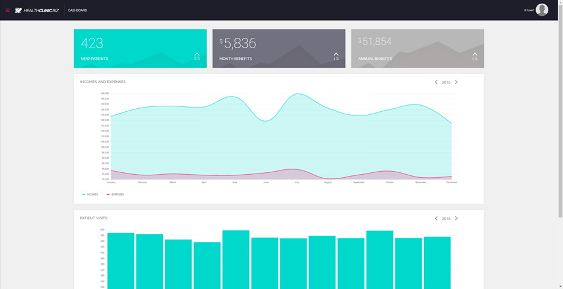

#My Health Clinic

## Overview
My Health Clinic, a sample application built for demo and training purposes, is for a fictious health care provider **HealthClinic.biz**. 
HealthClinic.biz uses different Microsoft and multi-channel apps built with Visual Studio and Azure to grow their business and modernize their customer experience. 
They also innovate and offer multiple apps and services—including websites, mobile apps, and wearable apps—to empower their patient’s well-being with easy access to manage their healthcare data and stay healthy.

**Note:** The code has been modified from the original version. The mobile (Xamarin and Cordova) projects have been removed and the web project has been upgraded to work in Visual Studio 2017.      
You can find the old, original code on this [GitHub repo](https://github.com/Microsoft/HealthClinic.biz)

## Prerequisites
* Visual Studio 2017 
* Bower extension for Visual Studio Team Services 
* An active Azure subscription 

## Blogs posts

Here's links to blog posts related to this project:

[Connect(“demos”);](http://blogs.msdn.com/b/visualstudio/archive/2015/12/08/connect-demos-2015-healthclinic-biz.aspx) // 2015: HealthClinic.biz by Erika Ehrli
[ASP.NET 5 and .NET Core RC1 in context Plus all the Connect 2015]http://www.hanselman.com/blog/ASPNET5AndNETCoreRC1InContextPlusAllTheConnect2015News.aspx News by Scott Hanselman

